https://blog.csdn.net/danger/article/details/128214441

# ST电机库v5.4.4源代码分析(1)

# 第一章 电流分析


电流流经三个绕组会产生磁场，我们希望这个磁场的“合力”拉着转子做连续的圆圈运动，且大小可控。显然这个合成的磁场方向和转子的南北极方向垂直时产生的力矩最大。

根据数学理论，如果在三相中分别产生互差120度的相电流正弦波（也可以用相电压来描述），可以获得上述结果。因为电流和磁场的强度成正比，且磁场的南北极和电流方向相同，所以考虑电流就是考虑磁场。

标准三相电流Ia 、Ib 、Ic 在空间上互差120 ̊ ，假设Im 为相电流峰值，

```
Ia = Im *cos(θ)                                                  
Ib = Im *cos(θ-2π/3)                                      
Ic = Im *cos(θ-4π/3) = Im *cos(θ+2π/3)           
```

验证互差120° 相位的三相电流是否符合设想：

1）首先这种三相交错正弦波需要符合“基尔霍夫”定律：

```
Ia  + Ib  + Ic  = 0 
```

证明:

```
Ia + Ib + Ic  
=  Im *cos(θ) + Im *cos(θ-2π /3) + Im *cos(θ+2π /3)
=  Im *cos(θ) + Im *[cos(θ)*cos(2π /3) + sin(θ)*sin(2π /3)]
 + Im *[cos(θ)*cos(2π /3) - sin(θ)*sin(2π /3)]
=  Im *cos(θ) + 2* Im * cos(θ)*cos(2π /3)  
=  Im *cos(θ) + 2* Im * cos(θ)*(-1/2)
=  0
```

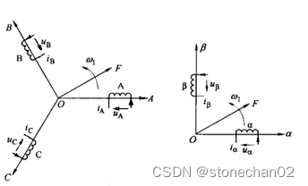

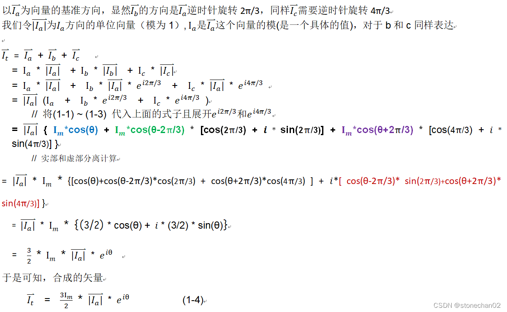

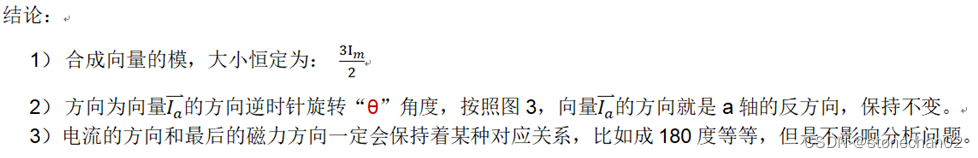

# 第二章 Clarke变换之等幅值转换推导

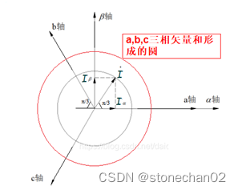

 图5

如上图所示，将a,b,c三轴电流矢量投影到α,β轴上可得

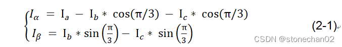

转换成矩阵如下式，其中系数*Ka*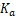 为三相变两相比例系数， 

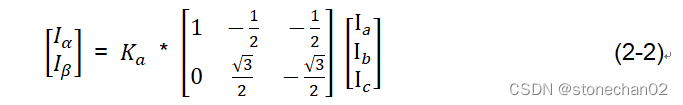

为了保证变换前后的幅值不变，即合成矢量的大小和方向相等。

由式1-4可知当*Ka* =2/3 时,转换前后幅值相等。

**解释：上图5中，红色的圆可以认为是式子(1-4)形成的圆，半径是黑色的圆的1.5倍，黑色的圆半径可以认为是本文开始推导中Im 的大小这里的等幅显然是和Im 进行等幅，所以需要缩小成2/3**

将*Ka* =2/3 及 I*c* = -(Ia+ I*b*)代入式2-2中可得：


 为了让式子2-2中矩阵可逆，引入0 轴（零轴）坐标


 于是1-7式子可以转换为：

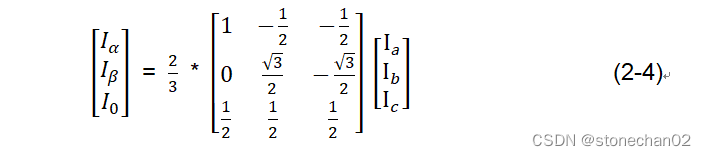


**备注：ST电机库5.4.4源代码对应的数学模型为：**

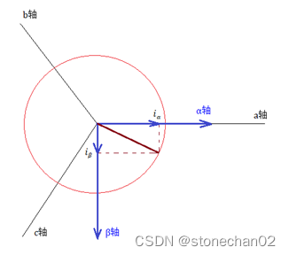

 所以它对应的Clarke公式为：


 注意上面式子中有一个“负号”。在看st电机源代码的时候以免疑惑！

# 第三章 Clarke变换之等功率转换推导

在应用中我们一般采取等幅值变换，所以本节仅仅作为数学推导学习用，可以跳过！

首先接着上述的等幅值变换我们用Λ表示转换矩阵，也就是说无论在等幅值变换还是等功率变换下恒存在：

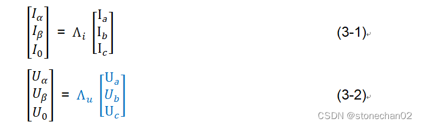

而三相电压和电流的转换矩阵实际上是相同的，也就是说： 


 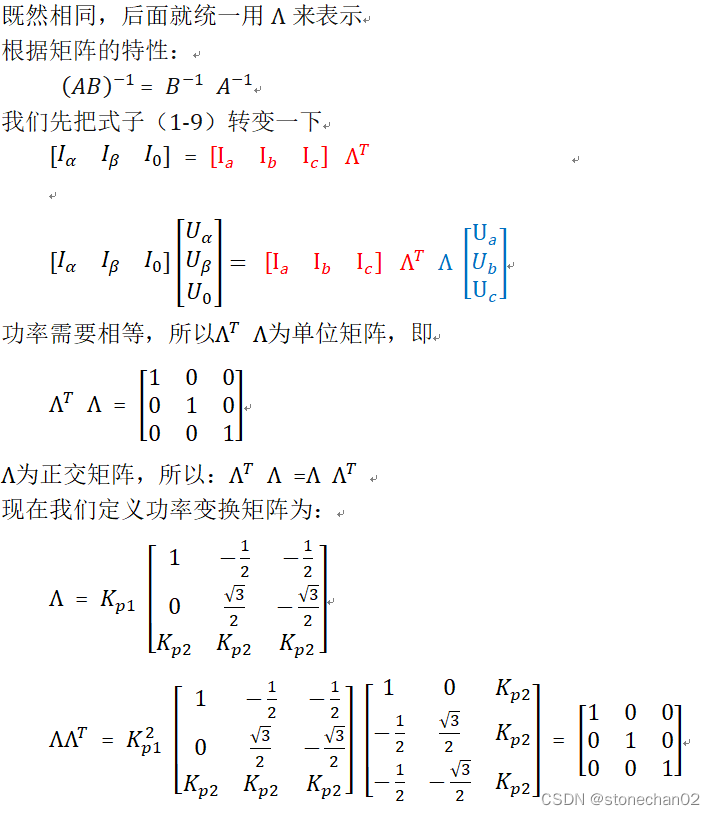

 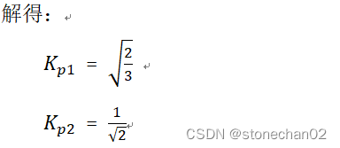

 等功率转换矩阵即为：

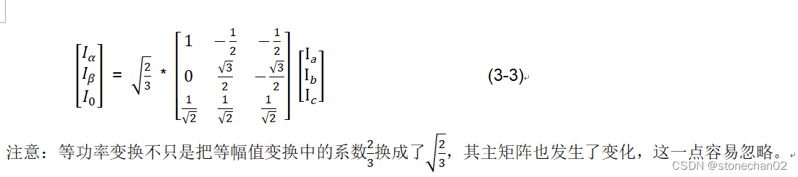

# 第四章 Park变换和逆变换

Clarke变换是将[三相系统](https://www.zhihu.com/search?q=三相系统&search_source=Entity&hybrid_search_source=Entity&hybrid_search_extra={"sourceType"%3A"article"%2C"sourceId"%3A317347351})(在 abc 坐标系中)的时域分量转换为[正交静止坐标系](https://www.zhihu.com/search?q=正交静止坐标系&search_source=Entity&hybrid_search_source=Entity&hybrid_search_extra={"sourceType"%3A"article"%2C"sourceId"%3A317347351})(αβ)中的两个分量

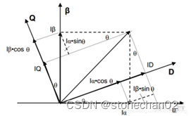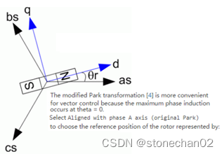

​             图4-1 

 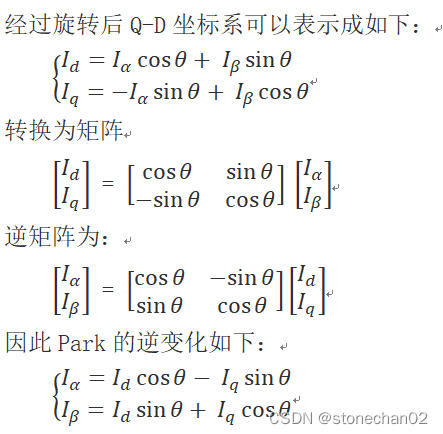


附录：ST电机库5.4.4源代码对应的数学模型如下：

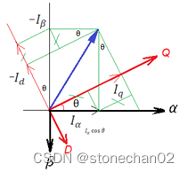 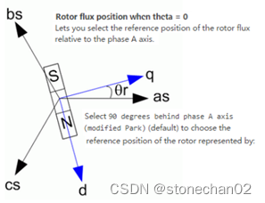

 所以它对应的Park转换公式为：

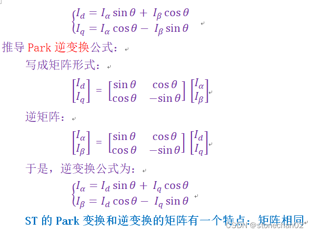

Q和D分别对应电机的Q轴(交轴)和D轴(直轴)，θ就是转子转动的角度，也就是d-q坐标系是始终随着转子进行转动的。

这个操作是可行的，因为我们会通过编码器输入转子的实时旋转角度，所以这个角度始终是一个已知数。经过这一步的变换，我们会发现，一个匀速旋转向量在这个坐标系下变成了一个定值！（因为参考系相对于该向量静止了，Id和Iq相对于D-Q坐标系），这个坐标系下两个控制变量都被线性化了！

在系统中我们就以Iq和Id这两个值作为反馈控制的对象，那么显然就可以使用一些线性控制器来进行控制了，比如PID。

# 第五章 SVPWM描述

5.1概述

SVPWM是近年发展的一种比较新颖的控制方法，是由三相功率逆变器的六个功率开关元件组成的特定开关模式产生的脉宽调制波，能够使输出电流波形尽可能接近于理想的正弦波形。空间电压矢量PWM与传统的正弦PWM不同，它是从三相输出电压的整体效果出发，着眼于如何使电机获得理想圆形磁链轨迹。SVPWM技术与SPWM相比较，绕组电流波形的谐波成分小，使得电机转矩脉动降低，旋转磁场更逼近圆形，而且使直流母线电压的利用率有了很大提高，且更易于实现数字化。

通俗化理解：把PMSM想象成两块同心的磁铁，两块磁铁是相吸的，因此当用手拨动外面的磁铁绕组圆心转动时，里面的磁铁也会跟着转动，这其实就是PMSM的本质了。PMSM的转子是永磁铁，定子是绕组，我们用电路控制定子绕组产生旋转的磁场，里面的转子磁铁就会跟着转动，这个磁场的大小最好恒定，不然一会儿大一会儿小，转子受到的牵引力也就一会儿大一会儿小，影响运动性能。好了，现在我们知道电机的本质是什么了。接下来，我们需要一个算法来控制定子绕组的输出，使其产生一个恒定的旋转磁场，这个算法就是SVPWM。


5.2  SVPWM基本原理

要得到一个恒定大小的旋转磁场，可以先来得到一个恒定大小的旋转电压矢量。如下图：

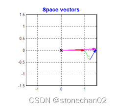

 从上图可知，我们可以通过互差120度，大小随着时间按正弦规律变化的3个分矢量来合成一个大小不变旋转的总矢量。于是问题又变成了：如何得到大小随着时间按正弦规律变化的3个分矢量呢？我们先回到电机上，其实这3个分矢量就对应了电机的3个绕组，3个绕组就是互差120度的，只要再控制绕组上的电压大小按照正弦规律变化，是不是就可以得到大小不变旋转的总矢量呢？看下面电机定子的坐标系图：

     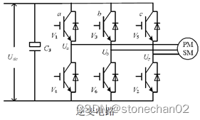

图5-2                           图5-3 


如果让绕组上的电压大小按照正弦规律变化呢？直接通交流电，就是正弦的呀，可不可以呢？驱动器的控制电路如上右

我们只能控制6个管子的开关而已，看来直接通交流电是不行了。于是我们只能控制PWM的占空比来等效正弦：

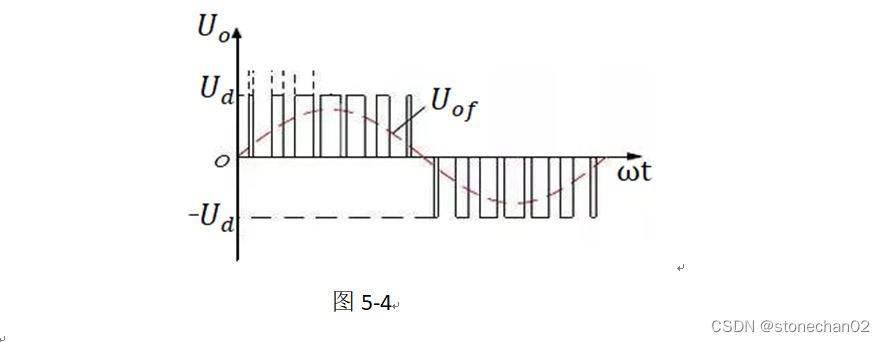

上面图是SPWM的示意图(不是SVPWM，SPWM又有很大不同，变频器中基本上运用的是SPWM技术)，这里描述原理而已。其实就是占空比越大，电压越大；占空比越小，电压越小。让占空比呈正弦变化，电压值自然也就呈正弦变化了。

我们用公式来表示一下：定义这三个电压空间矢量为UA(t)、UB(t)、UC(t)，他们方向始终在各自的轴线上，而大小随时间按正弦规律变化，时间相位上互差120度。假设U*m*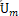 为相电压的最大值（相电压呈正弦变化），f为电源频率，则有：

 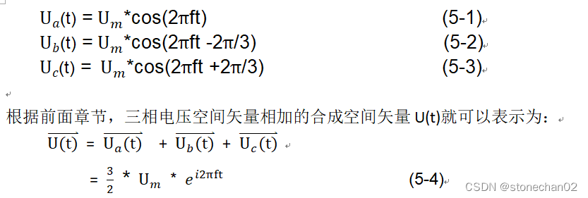

 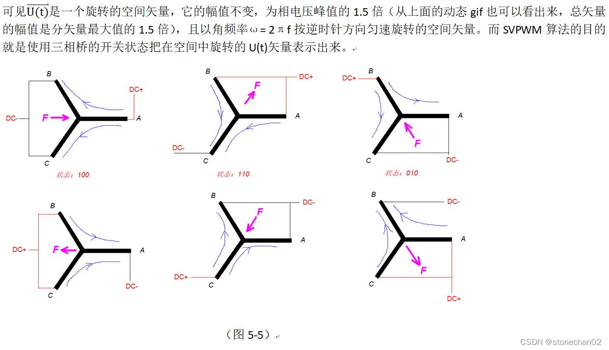

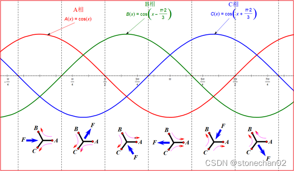


（图5-6）

 根据Clarke变化，添加一个参数K

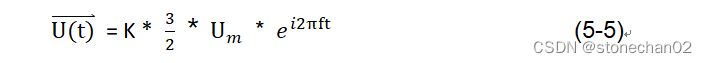

根据不同的需求选择不同的变换，K可以取不同的值。不同的需求如：要求功率不变、要求电压电流幅值不变等。我们这里为了使合成的空间矢量在静止的三相坐标轴上的投影和分矢量相等，取K值为2/3，这也是Clarke变换所采用的系数。

由于逆变器三相桥臂共有6个开关管，为了研究各相上下桥臂不同开关组合时逆变器输出的空间电压矢量，特定义开关函数Sx(x=a、b、c) 为：


(Sa、Sb、Sc)的全部可能组合共有八个，包括 6个非零矢量U1(001)、U2(010)、U3(011)、U4(100)、U5(101)、U6(110)、和两个零矢量 U0(000)、U7(111)。

下面以其中一种开关组合为例分析，假设Sx(x=a、b、c)=(100)，此时等效电路如图：

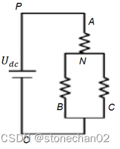

图5-6 

 因此相电压可以表示为：（***\*相电压\****是每相相对于电机中间连接点的电压）

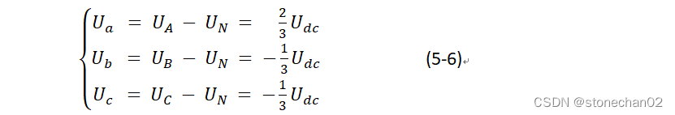

 同理可得，其他开关状态三相的相电压。另外线电压是两相之间的电压差，如：


前面章节中已经推导，三相相电压矢量与合成矢量的关系如下：

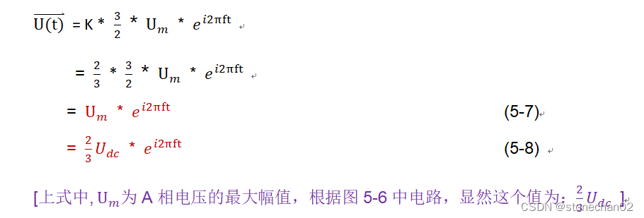 **[****下面阴影部分的内容，也是摘录网文，感觉和我们控制的实际情况差异很大，所以略过本理论，但还是节选下来****]**

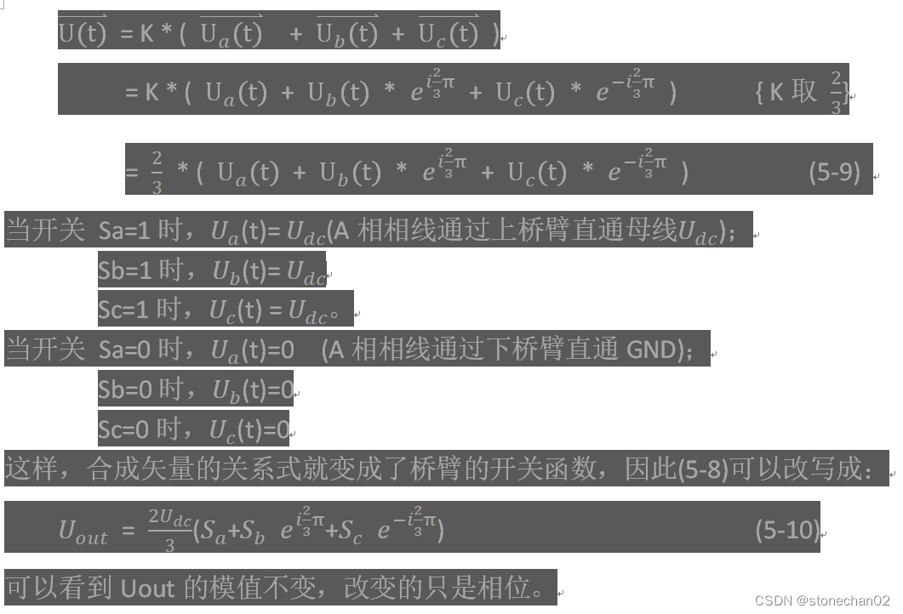

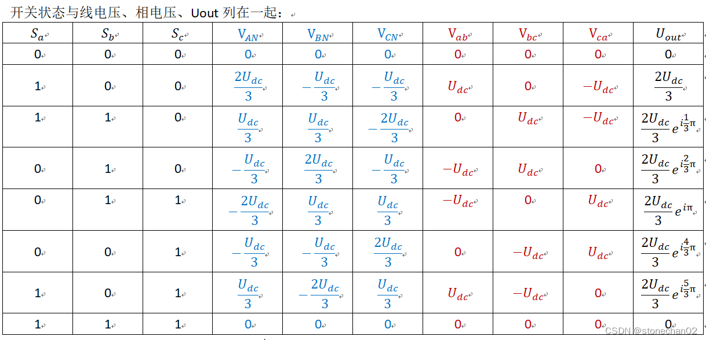

​                                           表5-1

把上面的8个电压空间矢量按照Uout的相位关系放在扇区图中：

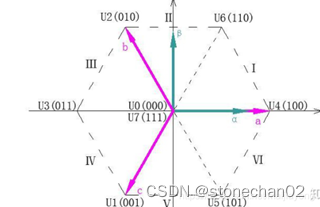


图5-7

上图中，6个非零矢量幅值相同，相邻的矢量间隔60度。两个零矢量幅值为零，位于中心。

我们真正想获得的合成矢量是一个绕着圆心旋转，半径保持固定


如果我们的硬件配置很强悍，可以直接输出三相UVW的正弦波形（比如采用DAC的方式等等），那么就直接根据余弦函数计算出幅值，进行DAC控制即可，可惜我们的硬件无法做到，我们能控制的仅仅只有6个mos管而已，也就是桥电路中的上下臂的控制，那么如何控制呢？

我们需要的合成矢量是一个围绕圆心旋转、幅值(半径)固定的向量，于是转换思路，可以采取两个向量合成的方式，比如上图5-7中，对于第Ⅰ扇区，我们就可以用U4和U6进行合成，因为U4和U6的方向是固定的，但是大小我们却可以通过占空比的方式进行控制，于是就可以进行合成了。

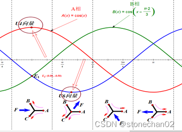

图5-8

如5-8中所圈出的两个点对应的向量，就是U4和U6


下面开始分析如何控制pwm进行合成：

三相电压给定所合成的电压向量旋转角速度为ω=2πf（即磁场旋转角速度）,则旋转一周所需的时间为T=1/ f；若开关管载波频率是 fs ，则频率比为 R=fs / f。这样将电压旋转平面等切割成R个小增量，亦即设定电压向量每次增量的角度是：γ=2π/ R。（注：这里就是把电压向量旋转一周，均分为R份，用来R边形来拟合圆形，同时这也代表了磁场旋转一圈，进行R次运算。因此载波频率越大，转速越小，电压旋转平面越接近圆形，反之，越接近多边形。当然载波频率太高的话，管子的开关损耗就比较大，一般取5K-10K）

这里补充详细描述一下，比如载波频率为10KHz，也就是我们控制uvw的pwm波形时的频率，周期为100us，假设向量旋转的频率为100Hz，也就是说马达转速为100圈/秒(6000rpm)，转一圈时间为10ms，计算R=10KHz/100Hz=100，也就是相当于10ms/100us=100次，也就是转一圈会计算100次。

实际上，软件中我们会固定在每个载波周期都进行一次FOC计算与控制，至于向量旋转1圈计算了多少次，就看向量转圈的周期了。

现在假设需要输出一个空间矢量*Uref* ，假设它在第Ⅰ扇区，我们先把第Ⅰ扇区单独取出来，然后用和它相邻的两个电压空间矢量来表示它：

 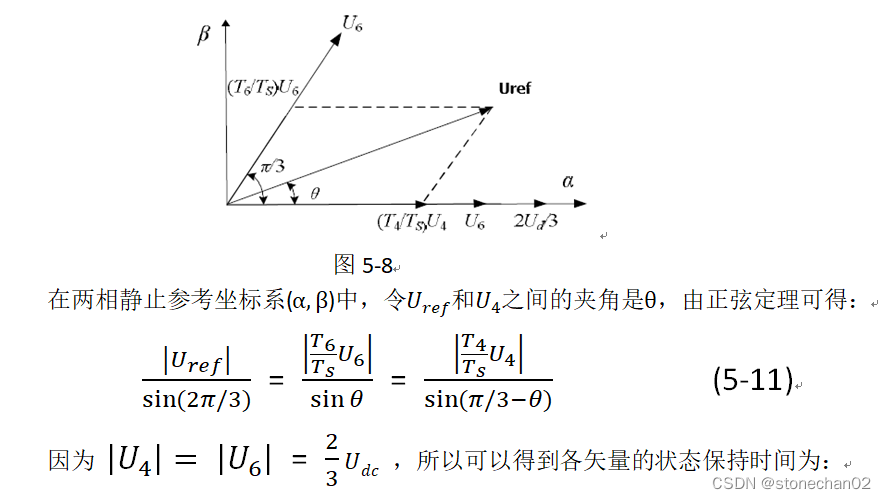

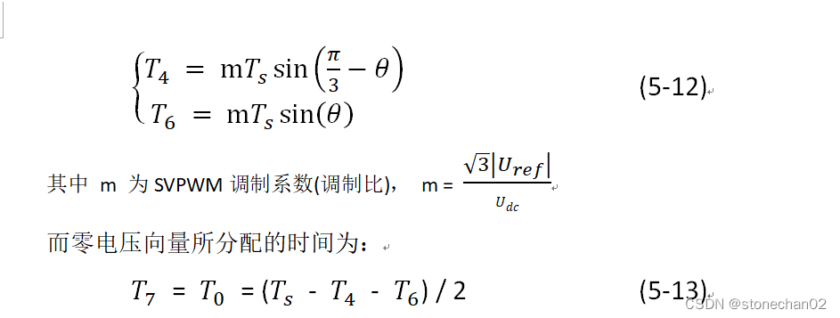


得到以*U4* 、*U6* 、*U7* 及*U0* 合成的*Uref* 的时间后，接下来就是如何产生实际的脉宽调制波形。在SVPWM 调制方案中，零矢量的选择是最具灵活性的，适当选择零矢量，可最大限度地减少开关次数，尽可能避免在负载电流较大的时刻的开关动作，最大限度地减少开关损耗。因此，我们以减少开关次数为目标，将基本矢量作用顺序的分配原则选定为：在每次开关状态转换时，只改变其中一相的开关状态。并且对零矢量在时间上进行了平均分配，以使产生的 PWM 对称，从而有效地降低 PWM 的谐波分量。可以发现当*U4* (100)切换至*U0* (000)时，只需改变 A 相上下一对切换开关，若由*U4* (100)切换至*U7* (111)则需改变 B、C 相上下两对切换开关，增加了一倍的切换损失。因此要改变电压向量*U4* (100)、*U2* (010)、*U1* (001)的大小，需配合零电压向量*U0* (000)，而要改变*U6* (110)、*U3* (011)、*U5* (101)， 需配合零电压向量*U7* (111)。这样通过在不同区间内安排不同的开关切换顺序， 就可以获得对称的输出波形，其它各扇区的开关切换顺序如下表所示。

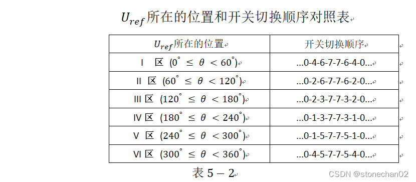

 因此就可以利用*U4* 、*U6* 、*U7* 及*U0* 的顺序和时间长短的搭配来表示出*Uref* 了。

  以第Ⅰ扇区为例，其所产生的三相波调制波形在一个载波周期时间*Ts* 内如下图所示，图中电压向量出现的先后顺序为*U0* 、*U4* 、*U6* 、*U7* 、*U6* 、*U4* 、*U0* ，各电压向量的三相波形则与上表中的开关表示符号相对应。在下一个载波周期*Ts* ，*Uref* 的角度增加一个γ，利用式（5-11）可以重新计算新的*T0* 、*T4* 、*T6* 及*T7* 值，得到新的类似下图的合成三相波形；这样每一个载波周期*Ts* 就会合成一个新的矢量，随着θ的逐渐增大，*Uref* 将依序进入第Ⅰ、Ⅱ、Ⅲ、Ⅳ、Ⅴ、Ⅵ区。在电压向量旋转一周期后，就会产生R个合成矢量。

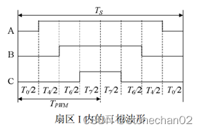

图5-9


  因此SVPWM会在每个载波周期进行一次计算。

  通过以上 SVPWM 的法则推导分析可知要实现 SVPWM 信号的实时调制， 首先需要知道参考电压矢量 Uref 所在的区间位置，然后利用所在扇区的相邻两电压矢量和适当的零矢量来合成参考电压矢量。

  控制系统需要输出的矢量电压信号 *Uref* ，它以某一角频率ω在空间逆时针旋转，当旋转到矢量图的某个60°扇区中时，系统计算该区间所需的基本电压空间矢量，并以此矢量所对应的状态去驱动功率开关元件动作。当控制矢量在空间旋转360°后，逆变器就能输出一个周期的正弦波电压。


| *Uref* 所在的位置                   | 开关切换顺序          | 波形输出                                                  |
| ----------------------------------- | --------------------- | --------------------------------------------------------- |
| I **区** (*0**°* *≤ θ <**60°* )     | ...0-4-6-7-7-6-4-0... | 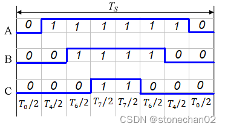 |
| II **区** (*60**°* *≤ θ <**120°* )  | ...0-2-6-7-7-6-2-0... | 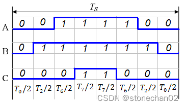 |
| III**区** (*120**°* *≤ θ <**180°* ) | ...0-2-3-7-7-3-2-0... | 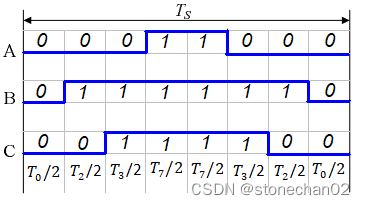 |
| IV**区** (18*0**°* *≤ θ <**240°* )  | ...0-1-3-7-7-3-1-0... | 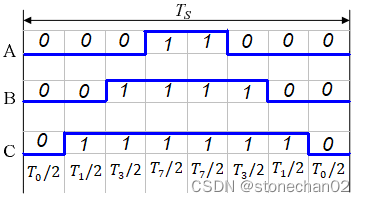 |
| V **区** (*240**°* *≤ θ <**300°* )  | ...0-1-5-7-7-5-1-0... | 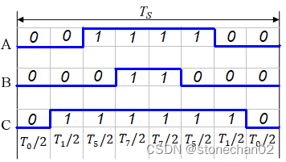 |
| VI**区** (*300**°* *≤ θ <**360°* )  | ...0-4-5-7-7-5-4-0... | 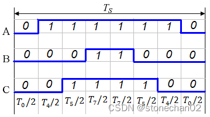 |

​                                      表5-3


# **第六章 SVPWM怎么和FOC算法对接**

说完了SVPWM算法，我们来对接FOC算法，框图如下：


​                                 图6-1 矢量控制方框图


理解前后关系：FOC的输出是SVPWM的输入，SVPWM输出是三相电压的占空比，也就是最终设置到计时器中的比较寄存器的值。那么FOC输出的是什么呢？这里直接给出结论是*V**α* 和*V**β* ，这个也与直轴和交轴方向相同的两个电压矢量。

***\*直轴\****：转子N到S的方向      

***\*交轴\****：与直轴垂直，维持转子转动的方向，在电机转动的过程中，交轴方向的力是维持转子转动的，而直轴上的力对转动无效果，因此我们应该尽力让其为0。

上图中的第7部分就是SVPWM，其作为FOC最终的执行部分，接收FOC传来的*Vα* 和*Vβ* ，然后通过上面的过程转换成开关管的控制信号，控制定子绕组产生旋转磁场。 

**6.1****合成矢量*****Uref\*** **所处扇区N 的判断**

  空间矢量调制的第一步是判断由*Uα* 和*Uβ* 所决定的空间电压矢量所处的扇区。

假定合成的电压矢量落在第 I 扇区，可知其等价条件如下：

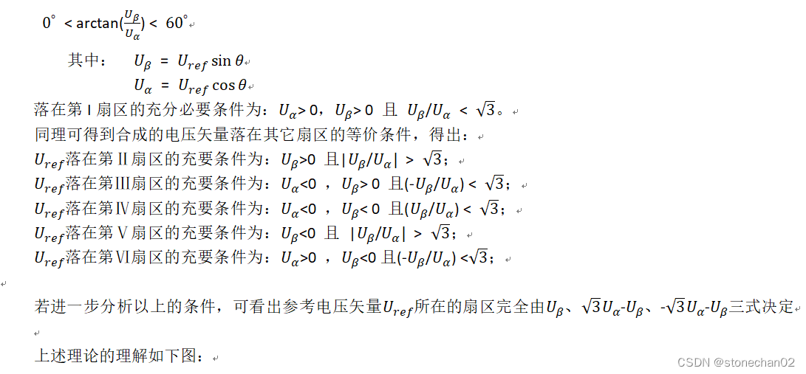

 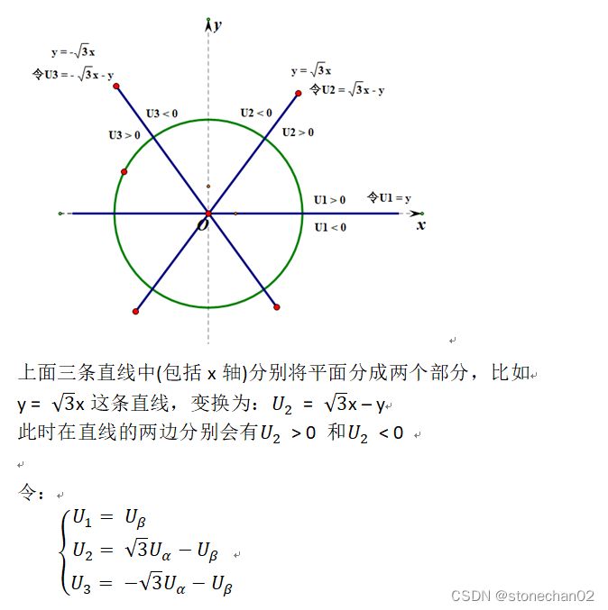

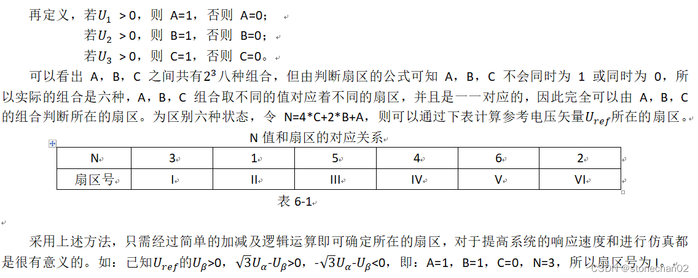

【备注：上面是原理，对于ST电机库源代码中的判断，又有一些变形，我们后面有专门的的章节详细解读源码】

**6.2** **基本矢量作用时间计算与三相 PWM 波形的合成**

  在传统 SVPWM 算法如式（5-11）中用到了空间角度及三角函数，使得直接计算基本电压矢量作用时间变得十分困难。实际上，只要充分利用*Uα*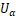 和*Uβ*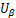 就可以使计算大为简化。

 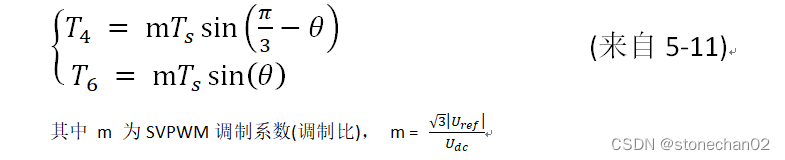


我们来分析一下FOC整个控制过程：

1. 采集ABC三相中的二相(有2相即可，第3相可以推导出)。
2. clarke变换生成*α* 、*β* 相
3. park变换为d-q坐标系
4. 进行PI等控制+磁链圆
5. 反park重新获得*α* 、*β* 相


这里到第(5)步后就不要进行什么反克拉克变换之类的了，这里直接可以从*α* 、*β* 相获得pwm波形驱动的数据

下面的理论开始来解决这个问题：

以*Uref* 处在第Ⅰ扇区时进行分析，根据下图有：


​          图6-2 电压空间向量在第Ⅰ区的合成与分解


*Ud* 就是*Udc* ，即母线电压。下式的最后把Ⅰ扇区两边的电压矢量*U4* (100)和*U6* (110)的*Uout* 式子带进来了，分别是2/3*Ud* 和2/3*Ud* *cos(π /3)：

 

 


 

 


!!

```
taon,tbon.tcon是不是计算错了，tbon=taon+Ty/2

是有点问题，那一小块的贴图是来自网络文章，结合自己的理解进行了整理，没有匹配好，主要是想尽量讲清楚原理！你看的很仔细！
```


不同扇区比较器的值之分配如下：


*Ta* 、*Tb* 和*Tc* 分别对应三相比较器的值，将这三个值写入相应的比较寄存器，就完成了整个svpwm算法。

*taon* 、*tbon* 、*tcon* 的波形呈马鞍形，如下：

 

  图6-5

这个计算出来的时间函数为什么会成马鞍波形？下面章节中会有，虽然是按照相电压进行说明。


# **第七章 SVPWM 物理含义**

SVPWM 实质是一种对在三相正弦波中注入了零序分量的调制波进行规则采样的一种变形 SPWM。但 SVPWM 的调制过程是在空间中实现的，而 SPWM 是在ABC 坐标系下分相实现的； SPWM 的相电压调制波是正弦波，而 SVPWM 没有明确的相电压调制波，是隐含的。为了揭示 SVPWM 与 SPWM 的内在联系，需求出SVPWM 在 ABC 坐标系上的等效调制波方程，也就是将 SVPWM 的隐含调制波显化。

为此，下面开始对其调制波函数进行了详细的推导。 由表格 5-3 我们知道了各扇区的矢量发送顺序：

奇数区依次为： 𝑈0， 𝑈𝑘， 𝑈𝑘+1， 𝑈7， 𝑈𝑘+1， 𝑈𝑘， 𝑈0

偶数区依次为： 𝑈0， 𝑈𝑘+1， 𝑈𝑘， 𝑈7， 𝑈𝑘， 𝑈𝑘+1， 𝑈0

扇区序号k，𝑈𝑘和𝑈𝑘+1对应着这个扇区边缘的两个矢量，k和k+1按照逆时针顺序。比如对于第1扇区，𝑈𝑘和𝑈𝑘+1就分别对应着图6-3中的𝑈4和𝑈6

利用空间电压矢量近似原理，可总结出下式：


 上式中k对应扇区号，从1开始，上面式子容易推导和理解，具体看上一章节图6-1对应的公式推导；对于第1扇区，去推导一下T4和T6就更清楚了，这里仅仅记录结果。


图7-1    第I扇区相电压的平均值


同样可以推导出其它扇区的调制波函数，其相电压调制函数如下

 

 图7-2 各扇区相电压调制函数


图7-3 扇区线电压调制波函数

从图7-2来看，输出的是不规则的分段函数，为马鞍波形（这样也解决了上一章中时间比较值为什么是马鞍波形的问题）：


图7-4 相电压的马鞍波形


从线电压调制波函数公式图7-3来看，其输出的则是正弦波形


图7-5 线电压的正弦波形


\8. 附录，一个几何问题的证明

8.1  本命题为了解决：幅值最大不会超过图中所示的正六边形边界问题


​          图8-1            图8-2                  图8-3 

 


# ST电机库v5.4.4源代码分析(2): 磁链圆限制之计算以及一个小bug


***\*FOC\*******\*流程图 Circle_Limitation所在位置\****


图1

 

 图2

现在计算出了和，需要限制:


 如果

 

 显然需要一个缩小的系数*i* (*i* < 1)进行校正


这个开根号的计算对于一般单片机来说，运算还是很耗时的，所以这里要采取牺牲精度的快速查表计算方式。

下面的内容结合ST的电机库5.4.4中的源码进行说明

结合上图2中所示

​     S16_MAX = 32767 （S16_MAX是***\*16\*******\*位有符号数\****之最大值）

我们选取的“*MAX_MODULE*”的值不会直接让它等于S16_MAX，留一点余量，比如取99%或者98%等等。

​     M = 32767 * 99% = 32439.33

这里选择 32439，源代码“Inc\parameters_conversion.h”中也是如此定义：

 

 

下面开始推导表格中的缩小因子。以index=62区间段为例进行计算：

取区间段中的最大值：63*0x1000000-1，最大值的缩小程度最***\*“狠”\****，每个区间当然是选择最***\*“狠”\****的那个了。

根据上面的式子1-1，计算出来的缩放因子是一个小于1的小数，在计算机中不好存放，实际应用中将它放大32768倍，于是公式1-1变形为

​     当index = 62时

归纳为：


 上面表格中的数据明显和源代码中的数据表格不符合


​                                 图5

经过推导分析，源代码中表格***\*有错\****，应该修改表格为我们推导出来的数据表格。


那么源代码中的表格是怎么来的呢？根据我的分析最后发现应该将源代码中定义修改为：


​                                 图6

后，才能将源代码中的定义和表格相匹配！也就是源代码表格采用的是大概98%的MAX_MODULE值。

32121/32767=98.03%

同时针对图6中的这个定义，我用Execl表格也推导了一份

 


瞧！这个表格中的数据和源代码中的表格吻合到***\*完美无缺\****！

所以，ST马达库5.4.4中的代码有个小Bug（影响不大），订正时，要么修改表格，要么修改#define定义值，本篇文章主要是探索一下这些定义的表格数据是咋来的而已！

备注： Execl表格中数据的计算公式为（假设放在C栏，B栏放61,62，...）：

以C5为例(C4放着62）：

​     =SQRT(32439*32439/(((C4+1)*16777216)-1))*32768


# ST电机库v5.4.4源代码分析(3): α、β方向的电流值与三相PWM 波形的联系


  我们通过一系列的运算最后通过反park计算出了*α*、*β*方向的电流，那么如何将这两个电流值换算成[pwm](https://so.csdn.net/so/search?q=pwm&spm=1001.2101.3001.7020)控制duty的实际参数呢？

本文结合ST电机库中的源代码，生成源代码的电路板采用的是[野火](https://so.csdn.net/so/search?q=野火&spm=1001.2101.3001.7020)公司的407电机控制板。

为了让整个控制流程的脉络更加清晰，这里贴出调用的框架代码：


原理上请首先阅读我的博文：

https://blog.csdn.net/danger/article/details/128214441

这里截取文章中部分内容


6个空间向量(U1~U6)的作用时间和*α*、*β*方向的电压的关系总结


 ST马达库中采用的*α*- *β*坐标系中的*β*的方向和我们上面的数学模型相反，ST的模型如下：

 

现在我们开始对照ST源代码中的相关内容，也就是文件“pwm_curr_fdbk.c”中函数“PWMC_SetPhaseVoltage()” 


 

 根据源代码中定义的wX、wY和wZ等值以及它对应的数学模型，我们可以画出如下图:

看上面的图示，然后对照源代码，怎么分sector就一目了然了。


瞧！已经和我们推导出来的“CntA、CntB和CntC”神似，只需要令：

   K = 1 / 262144

那么就能完美吻合，也就是理论和实践（ST的源代码）已经很吻合了。

我们后面再来探讨这个K值的问题，下面继续看看源代码中针对计算出来的值的使用...

函数“PWMC_SetPhaseVoltage()”中最后将计算出来的“wTimePhA”等值送入了“pHandle->CntPhA”中

 


***\*为什么这个pwm波形中高电平时间的1/2直接送入比较器？\****

为了解决这个问题我们来看看TIM1以及它对应的pwm波形输出之设定配置

文件：“main.c”中有：


注意上图中红框标注处的设置

我们找到stm32f407的手册中的相关部分：

 


 


 


查看“R3_2_GetPhaseCurrents()”函数，发现直接将采样电阻处的ADC之转换值当做电压值进行Clarke等等一系列计算，也就是ADC采样count值等效成了电压值

再看ADC的控制设置（ADC1和ADC2的设置几乎一样）


 


 


 


# ST电机库v5.4.4源代码分析(4): 电角度和力矩方向分析（Hall传感器）


**一）****ST****马达库中角度的定义**

引言：

在Clerke以及park等变换中，我们都涉及到了角度，本文中我们结合ST的源代码探讨一下角度的取得以及它和力矩的关系问题。


首先回顾《马达控制之[FOC](https://so.csdn.net/so/search?q=FOC&spm=1001.2101.3001.7020)原理》一文中的的数学模型

https://blog.csdn.net/danger/article/details/128214441


三相电流中Ia达到幅值的最高峰时，它的反电动势也就是最大值，于是：***\*电机\*******\*A\*******\*相的反电动势最高点就是电角度的\*******\*0\*******\*度\****

在实际运行中进行测量反电动势然后判断是否到达最大值，而且[ADC采样](https://so.csdn.net/so/search?q=ADC采样&spm=1001.2101.3001.7020)还存在不稳定性，所以几乎是不可能完成的任务，本文建立在系统采用了Hall传感器，所以我们可以在实验环境下提前测试出Hall中H1和A相反电动势之间的角度差，而在软件运行过程中可以检测到Hall的IO口线跳变中断，于是，在每次Hall跳变中就可以进行电角度的“校准”了。注意这里说的是“校准”！在两个Hall状态变化的中间过程中，角度的计算是依靠目前的“电角度速度”和“经过的时间”进行估算的，直到遇到了一次Hall相变，于是就可以“校准”电角度了。


ST源代码定义：电机Hall A的上升沿到电机A相反电动势最高点的延迟角度为***\*同步电角度\****

​       换一种说法： **“从电机****A****相反电动势最高点”再经过\**同步电角度\**就会遇到“电机****Hall A****的上升沿”**

下面节选文档“电机控制同步电角度测试说明.pdf”中部分内容


上图中如果周期为T， 那么同步电角度就是：(T-delay) * 360 / T

再贴出文档“电机控制同步电角度测试说明.pdf”中一个计算电角度的例子：


 野火BLDC电机在workbench中的配置：


 生成的ST马达库源代码对应的设置部分：


 因为Hall的三个传感器每个跳变时，角度都相差60度，于是在每种Hall状态机的跳变都可以进行校准电角度了


 下面剖析一下源代码


 

 可以画出对应的Hall时序图：


运行过程中Hall传感器是贴在定子上的保持不动的，显然图中的Hall波形是转子逆时针旋转时输出的波形。

分析源代码：


​                                   图9

对于源代码行“Line 551”和“Line 555”中设置的方向，正方向“POSITIVE”就对应上图模型中的逆时针方向了，因为对应着： 

​        “状态4” ==> “状态5”

源代码中“Line 552”和“Line 556”设置角度，看下面的图示


 于是可知：


表格1中仅仅列出2行，后面就不再列出，对着图10，后面的就自然很容易写出来，然后分析源代码就很简单了！


我们上面所述都是在中断中(Hall状态机的变化时刻)进行电角度的校正，而在任意时刻，进行FOC计算的时候，目前的电角度需要通过当前的平均电角度速度和经过的时间间隙相乘获得，具体参看源代码，比较容易理解，这里不再赘述，也许后续我会单独写一篇小文章详细描述一下这段源代码。


**二）两种****q-d****轴数学模型的比较**

park变换中q-d轴的数学模型目前有两种，《马达控制之FOC原理.docx》中公式的推导采用的是如下图11，而ST马达库中采用的是图12


 


**三）****ST****马达库中电角度的计算****(Hall****传感器****)**

3.1）注意程序中的两个变量的功能

***\*pHandle->MeasuredElAngle\**** **测量电角度**

是真正的标杆角度， 每次Hall边沿触发都会准确地"校准"它，然后在执行频率=16KHz的FOC运算之前、在函数“HALL_CalcElAngle()”中根据平均速度来累加修正它；

***\*pHandle->_Super.hElAngle\**** **实时电角度**

进行系列公式运算(Clerke、park等)时的角度，这个角度要永远跟随着“pHandle->MeasuredElAngle”，每次计算平均速度时(函数：HALL_CalcAvrgMecSpeedUnit()，调用频率=500Hz)，都要计算出“pHandle->MeasuredElAngle”和“pHandle->_Super.hElAngle”之间的偏差，然后在函数“HALL_CalcElAngle()”中一步一步、平滑地将这个值进行补偿，最后让角度“pHandle->_Super.hElAngle”跟上“pHandle->MeasuredElAngle”。

***\*pHandle->_Super.hElSpeedDpp\****

两次FOC运算间隔的时间段内(1/16K)，转动的角度值，以s16degree表示

3.2）如果有偏差，为什么不让“pHandle->_Super.hElAngle” 直接一步跟上“pHandle->MeasuredElAngle”？

因为程序需要让合成的矢量的圆周运动保持尽量平滑转动，一步跟上的话，矢量圆的转动角度就不那么平滑了！

3.3）几个函数

**3.3.1****）****HALL_CalcElAngle()**

这个函数用来更新“测量角度”和“实时电角度”：


 **3.3.2) HALL_CalcAvrgMecSpeedUnit()**

计算出平均电角速度，也就是两次FOC运算间隔的时间段内(1/16K)，转动的角度值，以s16degree表示

这里贴出做了详细注解的代码：


 

 


**3.3.3****）****HALL_TIMx_CC_IRQHandler()**

**Hall****信号捕获中断的处理**


 

 

 

 

 

3.3.4）运算中用到了变量“pHandle->PseudoFreqConv”和“pHandle->PWMNbrPSamplingFreq”的推导

这两个变量的初始化：


 详细的描述：


# ST电机库v5.4.4源代码分析(5): 每个扇区里面如何选择采样哪二相电流

''问题的提出：

   1）ST电机库中电流采样的实现

   2）每个电角度周期，共跨越6个sector，[STM32F407](https://so.csdn.net/so/search?q=STM32F407&spm=1001.2101.3001.7020)中有两个ADC(ADC1和ADC2)，所以在同一个时刻，可以采样UVW三路中的二路（另一路可以推导出来），这些电流值带着符号，那么：***\*源码中每个sector采集哪二路呢？\****


**一）针对电流采样的ADC触发的软件流程描述**

stm32f407中TIM1 的ch1~ch3用来输出互补型6路[pwm](https://so.csdn.net/so/search?q=pwm&spm=1001.2101.3001.7020)分别控制上下臂的6个mos管；ch4用来控制ADC触发的位置


 


**二）电流采集选择哪二相？**

首先源代码中的sector对应的值和Hall传感器对应的状态机的值不是一回事

源代码中sector顺序编码，是这样的：


 源代码“Src\mc_parameters.c”中，配置在不同的sector采集不同的两路相电流：


 “MCLib\F4xx\Inc\r3_2_f4xx_pwm_curr_fdbk.h”文件中定义有：


根据设置，可以知道

CH3对应U

CH4对应V

CH6对应W


全部的sector都构造成固定采集A相和B相，不香吗？这样设计有何考虑呢？

下面的图4可以查阅《马达控制之FOC原理.docx》，是第I扇区波形图

图5摘自《ST MC SDK 5.x 相电流检测与重构 位置速度信息获取.pdf》第8页


结合表1、图4和图5，很容易看出规律：

在第I扇区，“A+相”相比于B+和C+，它处于高电平的时间最长，那么反过来说，“A-相”处于低电平的持续时间最短，所以在第I扇区，不要采集A相，时间太短，对采集点的要求就高了很多，因为采集点要避开管子开关的时间等等。

其它的各扇区依次类推。


采样时间点的选择：

可以参考ST的培训资料，另一个渠道是从硬石公司的资料中可以进行理解


 下面我截屏其中的部分


注明： 本图片版权完全属于“硬石公司”，这里引用，如果有侵权，请联系本人，本博文目的完全是给技术控们贡献一点点自己的理解，没有半点商业行为！

图中绿色阴影部分，也就是C相的下桥臂导通的时间，如果它比“hTafter”时间长2倍，因为C相导通的时间段里有充裕时间进行ADC的采集

在ST马达库 “r3_2_f4xx_pwm_curr_fdbk.c”的源代码中，进行了推而广之：如果三相中下臂桥导通时间最短的那个（也许是A相或者B相），只要满足上面的条件，我们都固定去采集A相和B相，反正时间都足够！


图中B段的时间无法满足进行ADC采样(< hTafter * 2)，因为我们只需要采集两相电流，那么我们可以不考虑C相（C相下臂桥导通时间太短了），仅仅采集A相和B相，但是需要满足图中的时间段 A > B

此时将采样区间从C相下桥臂的开通点向前提前，避开“B时间段”

为什么满足了 “A时间段”> “B时间段”， 那么采样点就可以设置在hCntPhc – hTBefore 处呢？

***\*我觉得应该满足的条件是：\****

***\*hDeltaDuty > (hTafter + hTbefore)\****

从已知条件：

B < 2* hTafter

hDeltaDuty > B

也推不出我希望的条件！！！


上面第（3）种，无法避开所有干扰，只能硬着头皮采样了...

具体源代码请查阅：


# ST电机库v5.4.4源代码分析(6): PID以及相关参数


前言：

​     本文章探索st电机库自动生成的PID参数的由来，采用的控制板为[野火](https://so.csdn.net/so/search?q=野火&spm=1001.2101.3001.7020)407电机板+BLDC带Hall的电机。


在“Mcboot()”函数中初始化变量“PIDSpeedHandle_M1”


 将“pPIDSpeed[M1]”指针值(实际指向“PIDSpeedHandle_M1”)作为[速度环](https://so.csdn.net/so/search?q=速度环&spm=1001.2101.3001.7020)PID整定的相关参数


 我们来看代码中速度环整定的调用层次：

 

 所以，是在“中等频率任务”中进行速度整定，中等频率值怎么设定的呢？


 

 我们看看PI控制的代码


 


控制很简单，但是有这个限制边界的参数在里面


我们来看“PIDSpeedHandle_M1”是怎么定义的


 积分环节的数值限制


上面设定值“IQMAX * SP_KIDIV”是因为在程序中计算出的积分项值，它没有除“SP_KIDIV”

最后总输出的限制


 那么IQMAX定义成了什么呢？


为什么定义成这个值？


我们看到“pmsm_motor_parameters.h”文件中同样还有一个定义值也是“18746”


 下面是我在代码中的注释，截图下来：


 速度环PID整定程序中，我还有一点疑问(也许应该被称作改进建议？)，记录如下：


# ST电机库v5.4.4源代码分析(7): SpeednPosFdbk_Handle_t在几个结构体中的关系


前言：

​    SpeednPosFdbk_Handle_t在几个结构体中绕来绕去，我这里将其脉络梳理一下，方便读者理解代码。


先看下面的代码：


 最终的结果是：


在程序中我们计算出的电角度等值，全部放入了“HALL_M1._Super”中，而在力矩等计算中就可以通过“pSTC[M1]->[SPD](https://so.csdn.net/so/search?q=SPD&spm=1001.2101.3001.7020)”直接获取

比如：


 


# ST电机库v5.4.4源代码分析(8): 旋编怎么对齐

问题：

​       带旋编的电机(不是绝对位置旋编)，ST电机库是怎么对齐的呢？也就是说如何确定初始电角度的问题。


我们基于“D:\motorCtr\code\stm32f407IG\[FOC](https://so.csdn.net/so/search?q=FOC&spm=1001.2101.3001.7020)\FOC_YHF4_PMSM_Encoder_SpdCtr”项目进行讲解。本项目采用野火的407骄阳控制板+野火的直流无刷驱动板+野火PMSM电机


​                            图2

上面三个参数定义在文件中的作用位置：

 

​                            图3

注释里面说的很好：


​                            图4

我们来推导一下：

Av是放大倍数, Av = 8

Rs = 0.02

ADC的参考电压是3.3v，ADC出来的值左移过4位，最大值为0xFFF0，按照65535算


这里为什么不考虑1.24V ？其实这个1.24V是中间电位，在获取电流时都会把它减去的，所以不影响。


​                                          图6

现在继续看对齐相关代码：


​                                   图7

对齐控制要靠变量“EncAlignCtrlM1”起作用，这里将变量“VirtualSpeedSensorM1”以及另外两个都挂在“EncAlignCtrlM1上：


重点看下面几个状态机：

 

​                            图9

代码中添加了一个“虚拟速度传感器”


图10

但是，这两个数据结构的“_Super”却都是同样类型：

 

​                     图11

再看针对它的调用：


​                                   图12

对齐过程中不断调整力矩（力矩是一个逐渐增大的过程）


​                                    图13

 

​                            图14

状态机控制的调用函数名为“TSK_MediumFrequencyTaskM1”，这里为500Hz的调用频率，而力矩的精细控制是在“TSK_HighFrequencyTask”中：


​                            图15

看图中提出的问题：对齐的时候，采用了虚拟速度传感器，这里计算角度却是针对“ENCODER_M1”，为什么呢？

其实我们初始化时将“VirtualSpeedSensorM1. _Super. hElAngle”设置成了固定角度，比如本项目中为90度。

具体代码体现：


​                                   图16

在上图中代码，函数“EAC_StartAlignment()”中执行“VSS_SetMecAngle()”后，“VirtualSpeedSensorM1. _Super. hElAngle”中的值就是90度了（s16单位）


​                            图17

图17中代码，用来进行计算的电角度实际上是从“VirtualSpeedSensorM1. _Super. hElAngle”中获取，而图16中已经展示了这个值实际上就是一个固定的值：90度，这个90度也就是图1中，在代码生成器中设定的值。

 

总结：

​       控制对齐的策略就是一直用设定的角度进行计算，比如90度，其结果类似于一直针对90度施加力矩，经过规定的时间（比如本项目中为700ms）后，就认为对齐结束了。当然，施加力矩的过程，其大小是一个线性从小变大的过程。


在对齐过程中，在函数 “TSK_HighFrequencyTask()”中调用“ENC_CalcAngle()”基本没啥作用。