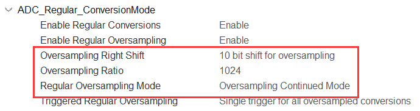
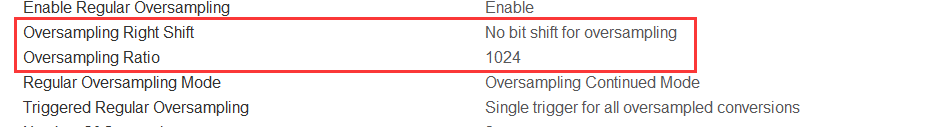
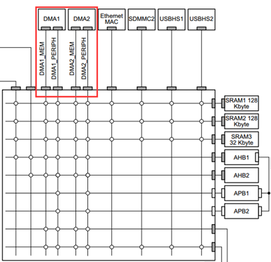

## 例程说明

```
ADC1: 26-bit Oversampling + DMA
ADC2: TIM TRGO (Update Event) + Double Buffer + DMA + FFT
ADC3: TempSensor + DMA

// ADC1: PC2,PC3
// ADC2: PC5
// ADC3: PC1,PC2,VRefint,ChipTemp

!! 用了 malloc 分配大数组, 必须调大 HeapSize。
```

### FFT

使用 CMSIS_DSP 计算 信号幅值，相位，频率。

* Magnitude
* Phase
* Frequency

#### DMA

##### Data Width

过采样：多次采样并求平均。（H7 最高可实现 26bit 分辨率）

```
when ADC.Oversampling.Ratio is 1024 (2 ^ 10 = 1024)

if ADC.Oversampling.RightBitShift = 10:
	- DMA.DataWidth = HalfWord  // DMA数据位宽
	- uint16_t DMA_Buffer[]     // 缓冲数组数据类型
	- ADConv = DMA_Buffer[n]    // ADC转换结果

if ADC.Oversampling.RightBitShift = 0:
	- DMA.DataWidth = Word
	- uint32_t DMA_Buffer[]
	- ADConv = DMA_Buffer[n] / Oversampling.Ratio
```

①




②




##### Difference

BDMA 不可以操作 TCM 区，其它的 SRAM 区均可操作。

BDMA 支持外设到外设，DMA1 和 DMA2 是不支持的，这个模式在低功耗模式下比较有用。

BDMA 的循环模式不可用于存储器到存储器模式。

BDMA 不支持硬件FIFO，但支持双缓冲。

BDMA 不支持突发模式。

* DMA（ADC1，ADC2）



* BDMA（ADC3）

同优先级的通道中断，优先响应编号低，即 Channel0 优先响应。


##### Double Buffer

双缓冲就是利用 DMA 的过半传输中断将数据缓冲区分为两部分。

##### DCache


开启 `DCache` 后必须用 `SCB_InvalidateDCache_by_Addr()` 刷新数据。

否则即使 ADC 正确采集了，缓冲数组中的值也不会更新。

