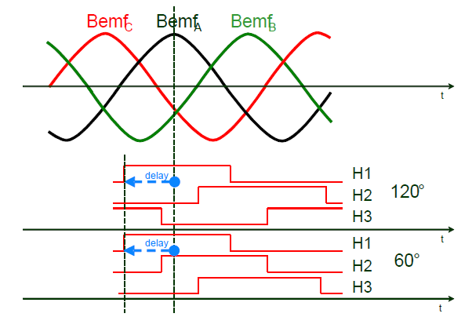
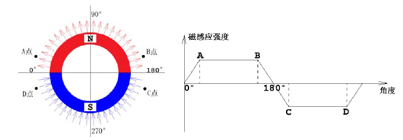
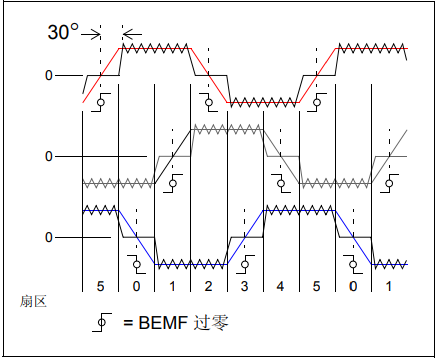

# [霍尔信号、编码器信号与电机转向](https://www.cnblogs.com/smilingfrog/p/7771367.html)

从电机出轴方向看去，电机轴逆时针转动，霍尔信号的序列为

编码器信号的序列为

将霍尔信号按照H3 H2 H1的顺序组成三位二进制数，则霍尔信号翻译成状态为

以120°放置霍尔为例

如不给电机加电，使用示波器测量三个霍尔信号和电机三相反电动势，

按照上面所说的方向用手转动电机得到下图

① H1的上升沿对应电机q轴与H1位置电角度夹角为0°，也就是state4->state5的变化点；

② H3的下降沿对应电机q轴与H1位置电角度夹角为60°，也就是state5->state1的变化点；

③ H2的上升沿对应电机q轴与H1位置电角度夹角为120°，也就是state1>state3的变化点；

④ H1的下降沿对应电机q轴与H1位置电角度夹角为180°，也就是state3->state2的变化点；

⑤ H3的上升沿对应电机q轴与H1位置电角度夹角为240°，也就是state2->state6的变化点；

⑥ H3的下降沿对应电机q轴与H1位置电角度夹角为300°，也就是state6->state4的变化点；

d轴永远滞后q轴90°。

电机按上述转向转动，当q轴与电机某相的电角度夹角为0°时，这时磁场由S极切换为N极，磁场强度为0，反电动势从0开始

当q轴与电机某相的电角度夹角为90°时，该相反电动势电压在最高点，夹角为180°时，反电动势电压在最低点。

由上图可以看出q轴与H1位置电角度夹角为0后，继续转动90°电角度后A相反电动势达到最高点，

也就是说①时，q轴与A相电角度夹角为0°，d轴与A相电角度夹角为-90°。

霍尔安装位置与线圈中心重合。

在电机制造中，对给定的H1位置与A相电角度夹角，霍尔实际安装的机械偏角由极对数和电子偏角共同决定。

 

# [无刷电机反电动势过零检测](https://www.cnblogs.com/smilingfrog/p/8488188.html)

反电动势公式 BEMF=NlrBω

其中，N=每相绕组匝数

l=转子长度

r=转子内半径

B=转子磁场

ω=角速度

 

针对梯形波反电动势无刷电机，在0°的时候，处于正反方向交界处，磁感应强度为零，然后开始线性增加，在A点时达到最大，然后一直保持恒定值不变，直到B点开始下降，到180°的时候下降到零。然后开始负向增长，在C点处达到负值最大，然后保持恒定负值不变，直到D点强度开始减弱，到0°时又回到零。至于A点到底在几度的位置，不同的电机不一样。如果A非常接近0°的位置，上升和下降直线就会非常陡峭，“梯形波”就变成了“方波”。根据右手定则E=BLV的公式，在匀速转动下，各绕组产生的反电动势波形也呈梯形波/方波。

 

当无刷电机两相通电，第三相不通电时，

通电的两相线圈对应的转子磁场强度不变，方向相反，且始终为磁钢最大磁场强度，这样两相的反电动势电压幅值相等，方向相反。

第三相的磁场强度则由由大到0，再反向增加，如上图BC部分。

完整的三相图如下

一个电周期由六个相等的 60º 部分组成，每个扇区与其 中的一个部分相对应 （扇区个数完全可以任意取）。换 相发生在每个扇区的边界处。因此，需要检测扇区边 界。在 BEMF 过零点和需要换相的位置之间，有一个 30º 偏移，必须对其进行补偿，以确保电机能够进行高 效、平滑地运行。

# [开关电源中的一些英文缩写](https://www.cnblogs.com/smilingfrog/p/4618295.html)

OCP over current protection 过流保护

OLP over load protection 过载保护

OVP over voltage protection 过压保护

OTP over temperature protection 过温保护

ESD eletro-static discharge 静电释放

UVLO under voltage lock out 欠压闭锁

PFC power factor correcion 功率因数校正

burst mode 跳周期模式 一般在空载下，启动几个周期，然后关闭几个周期，以减少空载待机功耗。

hiccup mode 打嗝模式，异常状态下的反复重启

Hiccup-mode is a method of operation in a power supply whose purpose is to protect the power supply from being damaged during an over-current fault condition. It also enables the power supply to restart when the fault is removed.

source current 拉电流 输出端向外电路流出的负载电流

sink current 灌电流 从外电路流入输出端的负载电流

quiescent current 静态电流

RCD residual current devices 剩余电流动作保护器

MOSFET栅极与源极间电阻

一、为场效应管提供偏置电压；二、起到泻放电阻的作用——保护栅极G-源极S；第一个作用好理解，这里解释一下第二个作用的原理——保护栅极G-源极S：场效应管的G-S极间的电阻值是很大的，这样只要有少量的静电就能使他的G-S极间的等效电容两端产生很高的电压，如果不及时把这些少量的静电泻放掉，他两端的高压就有可能使场效应管产生误动作，甚至有可能击穿其G-S极；这时栅极与源极之间加的电阻就能把上述的静电泻放掉，从而起到了保护场效应管的作用。

MOS管栅极与漏极和源极之间的绝缘电阻很高，绝缘层很薄，栅极很容易积累电荷把绝缘层击穿而损坏MOS管，在使用过程中如果有较高电压加到栅极也要击穿绝缘层而损坏MOS管，所以要在MOS管栅极并联稳压管以限制栅极电压在稳压管稳压值以下，保护MOS管栅极不被击穿。MOS管栅极并联的电阻是为了释放栅极电荷，不让电荷积累。总之与MOS管栅极并联的电阻稳压管起保护MOS管栅极的作用。