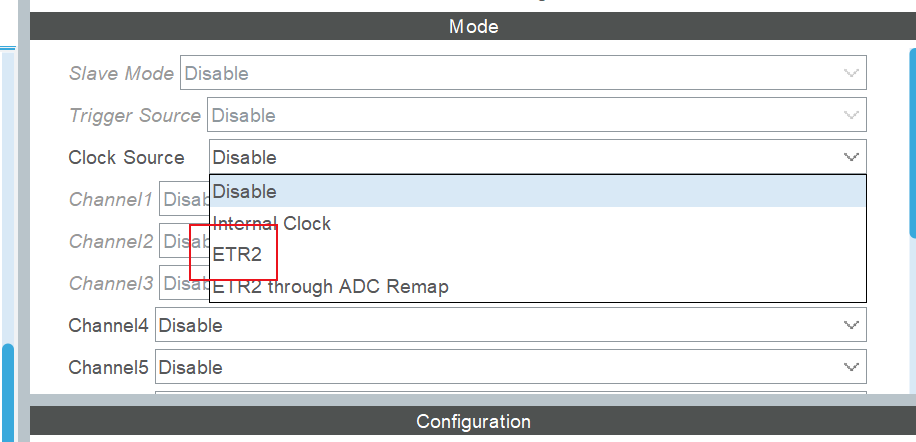
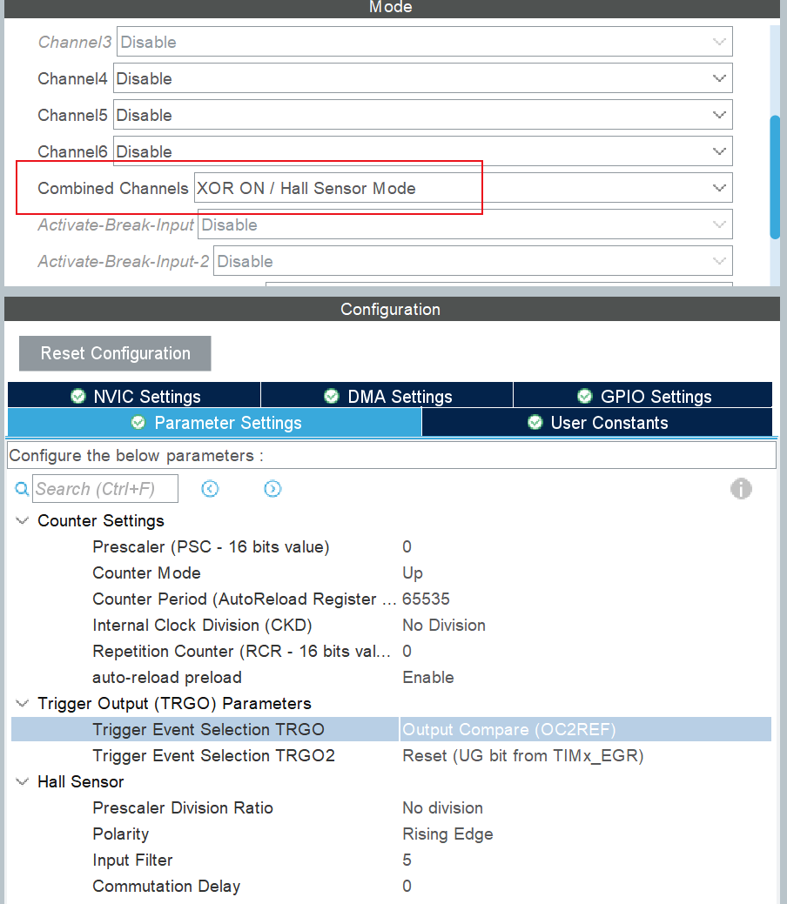
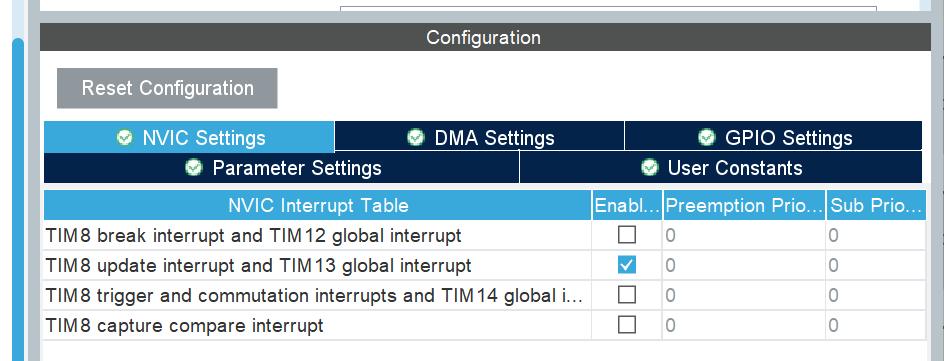
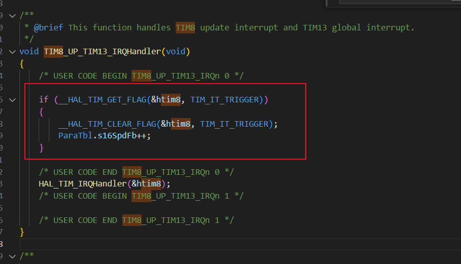

#### 霍尔状态读取

```c
void HallEnc_ReadState(hall_encoder_t* pEnc)
{
    uint8_t HallStateCur = 0, HallStatePrev;

    do {
        HallStatePrev = HallStateCur;
        HallStateCur  = 0;

        switch (pEnc->Placement)
        {
            case 60:  // DEGREES_60
            {
                HallStateCur |= ((HAL_GPIO_ReadPin(pEnc->HB_Port, pEnc->HB_Pin) == GPIO_PIN_SET) ^ 1) << 2;
                HallStateCur |= (HAL_GPIO_ReadPin(pEnc->HC_Port, pEnc->HC_Pin) == GPIO_PIN_SET) << 1;
                HallStateCur |= (HAL_GPIO_ReadPin(pEnc->HA_Port, pEnc->HA_Pin) == GPIO_PIN_SET);
                break;
            }
            case 120:  // DEGREES_120
            {
                HallStateCur |= (HAL_GPIO_ReadPin(pEnc->HC_Port, pEnc->HC_Pin) == GPIO_PIN_SET) << 2;
                HallStateCur |= (HAL_GPIO_ReadPin(pEnc->HB_Port, pEnc->HB_Pin) == GPIO_PIN_SET) << 1;
                HallStateCur |= (HAL_GPIO_ReadPin(pEnc->HA_Port, pEnc->HA_Pin) == GPIO_PIN_SET);
                break;
            }
        }

    } while (HallStateCur != HallStatePrev);

    pEnc->HallState = HallStateCur;
}

```

#### 霍尔测速

① 方式1：对单路霍尔的进行边沿计数



```c
// 原理：转子每转1圈，每路霍尔会产生与极对数相等个脉冲

int main()
{
    HAL_TIM_Base_Start(&htim);
    
    while(1)
    {
        SpeedCalc();
    }
}

static tick_t tSpdCalc = 0;

void SpeedCalc(void)
{
    HallEnc_ReadState(); // 更新电角度
    
   if (DelayNonBlockMS(tSpdCalc, 1000))
    {
        s16SpdFb = 60.f * __HAL_TIM_GET_COUNTER(&htim) / u16MotPolePairs; // RPM
        __HAL_TIM_SET_COUNTER(&htim, 0); // 复位计数值
        tSpdCalc = DelayNonGetTick();
    }
}
```

② 方式2：霍尔传感器模式 + 中断







```c
// 原理：转子每转1圈，3路霍尔会产生6*极对数个脉冲

int main()
{
    HAL_TIM_Base_Start_IT(&htim);
    
    while(1)
    {
        SpeedCalc();
    }
}

static tick_t tSpdCalc = 0;

void SpeedCalc(void)
{
   if (DelayNonBlockMS(tSpdCalc, 1000))
    {
        s16SpdFb = 60.f * u16HallEdgeCnt / u16MotPolePairs / 6; // RPM
        u16HallEdgeCnt = 0; // 复位计数值
        tSpdCalc = DelayNonGetTick();
    }
}

void TIM8_UP_TIM13_IRQHandler(void) // 更新电角度
{
	if (__HAL_TIM_GET_FLAG(&htim8, TIM_IT_TRIGGER))
    {
        __HAL_TIM_CLEAR_FLAG(&htim8, TIM_IT_TRIGGER);
        HallEnc_ReadState();
        u16HallEdgeCnt++;
    }
}
```

注：不要用以下中断

```
HAL_TIMEx_HallSensor_Start_IT() 
HAL_TIMEx_HallSensor_GetState() // 实际取的是定时器状态, 不是霍尔状态
```

