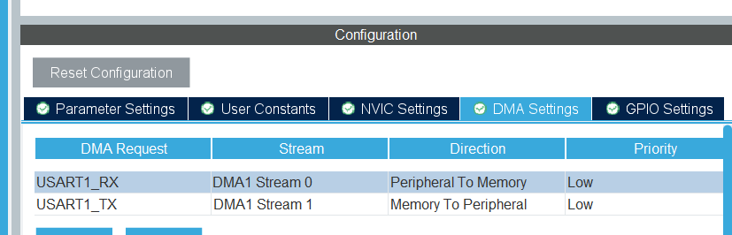
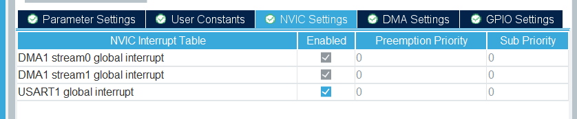
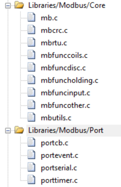
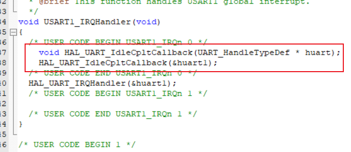

串口空闲中断 + DMA收发 + Modbus 从站。

## 流程

① 开启DMA及串口中断，其他默认即可





② 导入源文件



③  配置中断 `stm32h7xx_it.c` ：



```
void HAL_UART_IdleCpltCallback(UART_HandleTypeDef * huart);
HAL_UART_IdleCpltCallback(&huart1);
```

④ 初始化：

```
#include "mb.h"
#include "mbport.h"

extern void Modbus_StartReceive(void);

int main()
{
    const uint8_t ucSlaveID[] = {0xAA, 0xBB, 0xCC};
    eMBInit(MB_RTU, 1, 1, 115200, MB_PAR_EVEN);
    eMBSetSlaveID(0x34, true, ucSlaveID, 3);
    eMBEnable();
    Modbus_StartReceive();

    while(1)
    {
        eMBPoll();
    }
}
```

⑤ 编译

若提示缺少函数，就开 O1 或以上的编译优化即可。