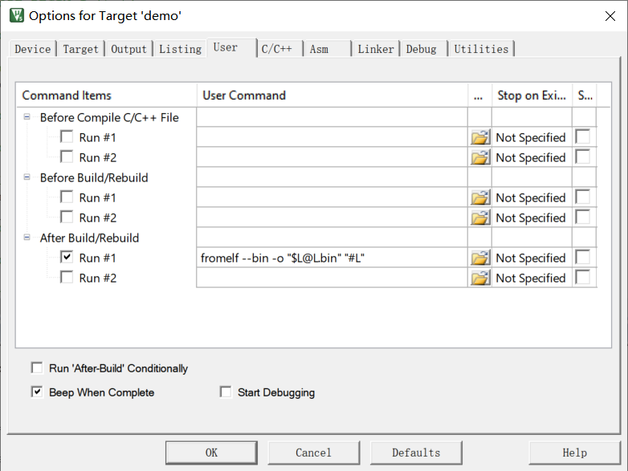

## compiler


```c
#if defined(__CC_ARM)  // AC5

#define __ASM    __asm    /*!< asm keyword for ARM Compiler        */
#define __INLINE __inline /*!< inline keyword for ARM Compiler     */

#elif defined(__ICCARM__)

#define __ASM    __asm  /*!< asm keyword for IAR Compiler        */
#define __INLINE inline /*!< inline keyword for IAR Compiler. Only avaiable in High optimization mode! */

#elif defined(__GNUC__)  // AC6

#define __ASM    __asm  /*!< asm keyword for GNU Compiler        */
#define __INLINE inline /*!< inline keyword for GNU Compiler     */

#elif defined(__TASKING__)

#define __ASM    __asm  /*!< asm keyword for TASKING Compiler    */
#define __INLINE inline /*!< inline keyword for TASKING Compiler */

#endif
```

## generate bin

```
fromelf --bin -o "$L@L.bin" "#L"
```

